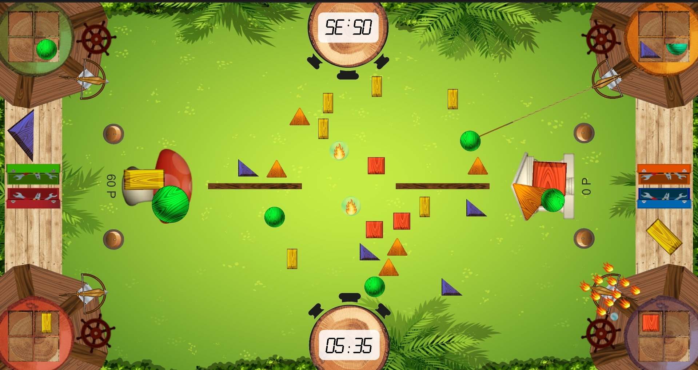

# ShapeMoji

## How to build the Project
[Build Guide](manual/build_guide.md)
1.  Clone the repository via `git clone https://gitlab.hochschule-stralsund.de/spo_ws2020_21/shapemoji/shapemoji.git`
2.  Start Unity Hub 
    1. Make sure the Unity Version 2019.4 LTS is installed or install the software over Installs > Add
    2. Click on &quot;Add&quot; Button
3.  Search for your clone in the File-Explorer 
    1. Open the folder &quot;shapemoji&quot; 
    2. Select the folder &quot;src&quot;
4.  Click on the added Project in Unity Hub 
    1. Unity will open the Project now, this may take some time
5.  If the Project is opened in Unity 
    1. Click on &quot;File&quot; 
    2. Choose &quot;Build Settings&quot; 
    3. Select your preferred Build Settings 
    4. Click on Build 
    5. Choose the location where you want to save the Build
6.  To run it start the .exe / .apk from your chosen file location

## Installation

### Windows
If you have downloaded the Product-ZIP (shapemoji-master-Executables-windows.zip) on your device just search for it in the file system and unzip it. Open the folder "Exectuables" in the unzipped folder, then open the folder "windows". In this folder you'll find the Shapemoji.zip, unzip this as well. Open the unziped folder and then start the "Shapemoji.exe".  The game will then start to run automatically.

### Android
If you have downloaded the APK on your device your system should install it automatically. Just start the App once it is finished to play the Game. You may need to activate "Allow Installations from unknown source" / "Allow installation from this source" on your device, the latter is recommended.

## Start the Game
### Prerequisites
Connect the PC to the Touch-Monitor with the HDMI Cable. Place the Touch-Monitor in the horizontal position for the best playing experience.

### Windows
Start the Shapemoji.exe. No further software must be installed to run the game. All Files and directories included in the .ZIP file must be in the same directory.

### Android
After the .apk has been installed onto the system, you can then run the game by opening the game from your app launcher.

## About the Game

The goal of the game is to get more points within 3 minutes as a single player or a team than your opposition. You can get points by positioning shapes on top of Emojis in a way that covers up the whole current Emoji.

### Game Modes

There are 2 game modes in the game, that can be selected in the main menu.

* 2vs2: 4 players are divided in 2 groups, each group consists of 2 players. The groups compete against each other.
* 1vs1: 2 players compete against each other.

### Gameplay
Before the game begins, each player decides at which base he will play during the game. Each player should stay near his base during the game.
The game begins, after the countdown is over.
During the game the players can shoot the projectile, in order to catch stones and items. Then the projectile must be dragged back to the base, by rotating the wheel. After the projectile is back at it's initial position, the hooked stone/item can be used.
The stones are placed into the inventory.
From the inventory the stones can be placed on the emoji and in the workshop.
In the workshop the stone can be scaled and rotated. Afterwards the stone can be dragged away to emoji.
The players try to cover the emoji with stones. For stones, that are badly placed, negative points will be added.
In order to get points for the emoji coverage, the toggle button must be activated. In game mode "2vs2", both toggle buttons must be activated. After it, a new emoji is loaded.
If a player activates Defect Item, the opponent's cannon starts to burn and must be restored with a water droplet.
The game can be paused by touching the timer in the game field.
The game ends after 3 minutes, the players will be warned with a countdown before the end.

