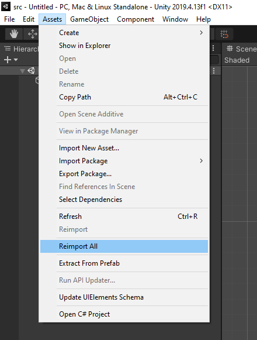

# Preparation

## Sofware Requirements

The following software modules are required to build the project

*   git
*   Unity-Hub
*   Unity 2019.4 LTS (2019.4.13f1 or higher)

## Unity

The project was developed and the build tested against the 2019.4 LTS-Version of Unity.

Please refer to the Unity Manual for an installation guide as well as the system requirements for Unity. https://docs.unity3d.com/2019.4/Documentation/Manual/GettingStartedInstallingUnity.html

Before continuing please make sure, that your Unity contains a valid license.

# Procedure

## 1\. Clone the repository

Clone the repository from https://gitlab.hochschule-stralsund.de/spo\_ws2020\_21/shapemoji/shapemoji to an appropriate place using

`git clone https://gitlab.hochschule-stralsund.de/spo_ws2020_21/shapemoji/shapemoji`

through the command line

## 2\. Add the repository to Unity Hub

Open up Unity Hub and go to &quot;Projects&quot;.  
Use the ADD button to add the &quot;src&quot;-folder of the cloned repository as a project to UnityHub.

<figure class="image image_resized" style="width:50.75%;"></figure>

## 3\. Open the Project

Open the Project by clicking on the added project called &quot;src&quot;.  
Make sure you have chosen the required &quot;Unity Version&quot;.

## 4\. Build the Project

In program menu select &quot;File&quot; &gt; &quot;Build Settings&quot;.

<figure class="image image_resized" style="width:19.9%;"></figure>

In the new window &quot;Build Settings&quot; select &quot;Build&quot;.

<figure class="image image_resized" style="width:34.84%;"></figure>

In the new window &quot;Build Windows&quot; select a folder, to save the new Build:

<figure class="image image_resized" style="width:32.89%;"></figure>

Afterwards the build folder contains all files generated in the build. Not all files are required to run the game. Make sure, the following files are copied:

<figure class="image image_resized" style="width:36.46%;"></figure>

The game contains the following components:

*   executable file ShapeMoji.exe
*   crash handler executable
*   the UnityPlayer.dll
*   ShapeMoji asset files
*   Mono runtime

The game can now be run by double-clicking the ShapeMoji.exe file

# Troubleshooting

Check the lower left corner for any exceptions like the following:

<figure class="image image_resized" style="width:34.44%;"></figure>

If the same exception appears just click on &quot;Assets/Reimport All&quot;.

<figure class="image image_resized" style="width:24.93%;"></figure>